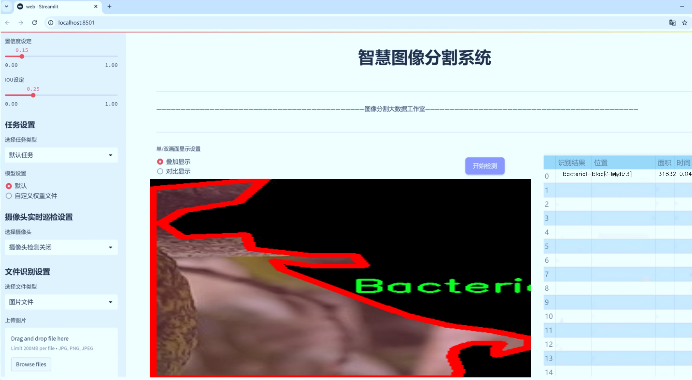
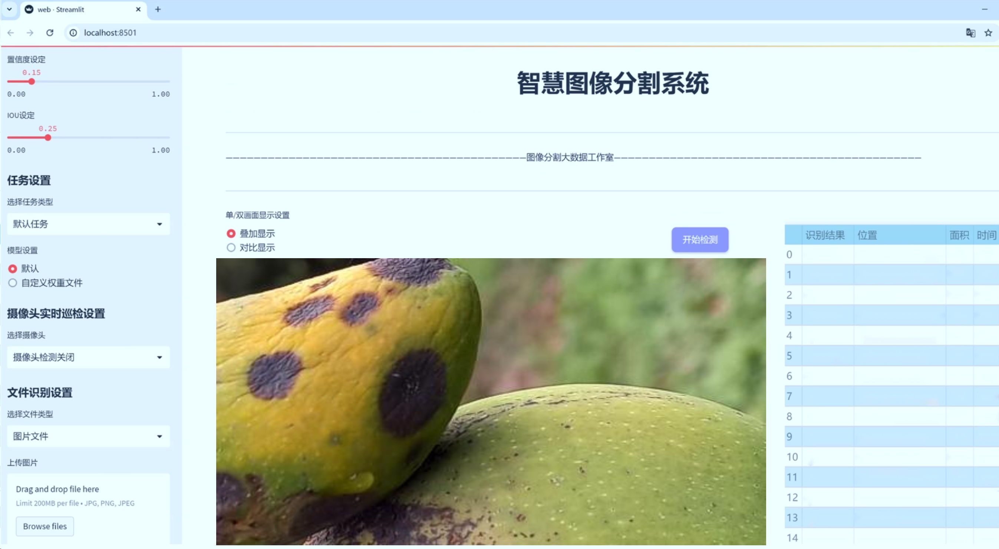
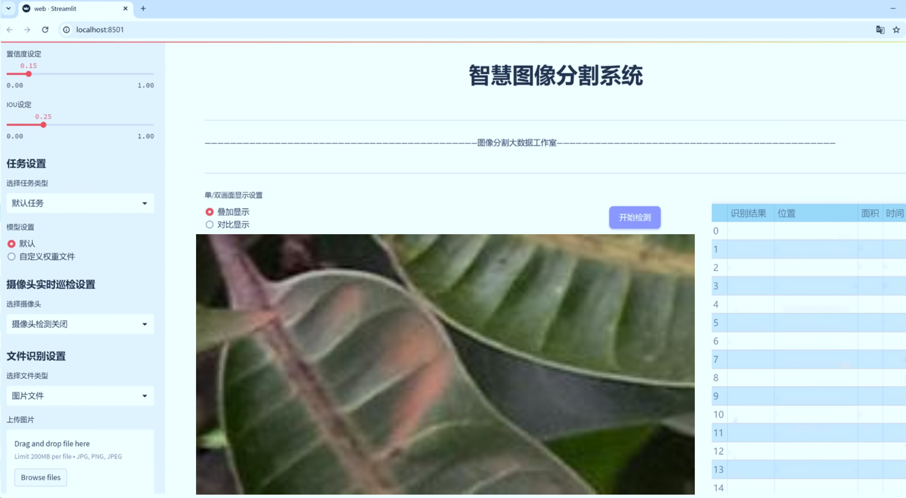
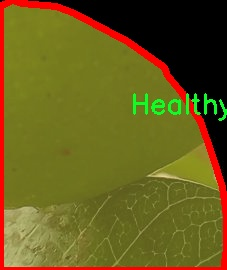

# 芒果叶片损伤分类图像分割系统源码＆数据集分享
 [yolov8-seg-CSwinTransformer＆yolov8-seg-C2f-FocusedLinearAttention等50+全套改进创新点发刊_一键训练教程_Web前端展示]

### 1.研究背景与意义

项目参考[ILSVRC ImageNet Large Scale Visual Recognition Challenge](https://gitee.com/YOLOv8_YOLOv11_Segmentation_Studio/projects)

项目来源[AAAI Global Al lnnovation Contest](https://kdocs.cn/l/cszuIiCKVNis)

研究背景与意义

随着全球农业生产的不断发展，作物病害的监测与管理变得愈发重要。芒果作为一种广受欢迎的热带水果，其种植面积和产量逐年增加。然而，芒果叶片在生长过程中容易受到多种病害的侵袭，如炭疽病、细菌性黑斑病、机械损伤等，这些病害不仅影响了芒果的生长和产量，还对果实的品质造成了严重影响。因此，及时、准确地识别和分类芒果叶片的损伤类型，对于提高芒果的产量和品质、降低农药使用、实现可持续农业发展具有重要意义。

传统的病害识别方法多依赖于人工观察和经验判断，这不仅耗时耗力，而且容易受到主观因素的影响，导致识别的准确性和一致性不足。随着计算机视觉技术的迅速发展，基于深度学习的图像处理方法逐渐成为病害检测的主流手段。其中，YOLO（You Only Look Once）系列模型因其高效的实时检测能力和较高的准确性而备受关注。YOLOv8作为该系列的最新版本，具备了更强的特征提取能力和更快的处理速度，能够在复杂的农业环境中实现高效的图像分割和分类。

本研究旨在基于改进的YOLOv8模型，构建一个针对芒果叶片损伤的分类图像分割系统。该系统将利用一个包含1300张图像的多类别数据集，涵盖了七种不同的损伤类型，包括炭疽病、细菌性黑斑病、机械损伤等。这一数据集的构建不仅为模型的训练提供了丰富的样本，也为后续的模型评估和应用奠定了基础。通过对这些损伤类型的准确分类和分割，能够为农民和农业管理者提供科学依据，帮助他们制定针对性的病害防治措施，从而有效降低病害对芒果生产的影响。

此外，本研究的意义还在于推动农业智能化的发展。随着物联网和人工智能技术的不断进步，农业生产正朝着智能化、自动化的方向发展。通过构建高效的图像分割系统，可以实现对芒果叶片损伤的实时监测，进而为精准农业提供数据支持。这不仅能够提高农业生产的效率和效益，还能为实现可持续发展目标贡献力量。

综上所述，基于改进YOLOv8的芒果叶片损伤分类图像分割系统的研究，不仅具有重要的理论价值，还具备广泛的应用前景。通过该系统的实现，将为芒果病害的监测与管理提供新的思路和方法，推动农业生产的智能化转型，最终实现提高芒果产量和品质的目标。

### 2.图片演示







##### 注意：由于此博客编辑较早，上面“2.图片演示”和“3.视频演示”展示的系统图片或者视频可能为老版本，新版本在老版本的基础上升级如下：（实际效果以升级的新版本为准）

  （1）适配了YOLOV8的“目标检测”模型和“实例分割”模型，通过加载相应的权重（.pt）文件即可自适应加载模型。

  （2）支持“图片识别”、“视频识别”、“摄像头实时识别”三种识别模式。

  （3）支持“图片识别”、“视频识别”、“摄像头实时识别”三种识别结果保存导出，解决手动导出（容易卡顿出现爆内存）存在的问题，识别完自动保存结果并导出到tempDir中。

  （4）支持Web前端系统中的标题、背景图等自定义修改，后面提供修改教程。

  另外本项目提供训练的数据集和训练教程,暂不提供权重文件（best.pt）,需要您按照教程进行训练后实现图片演示和Web前端界面演示的效果。

### 3.视频演示

[3.1 视频演示](https://www.bilibili.com/video/BV1zjmLYPE7r/)

### 4.数据集信息展示

##### 4.1 本项目数据集详细数据（类别数＆类别名）

nc: 7
names: ['Anthracnose', 'Bacterial-Black-spot', 'Damaged-mango', 'Fruitly', 'Healthy-mango', 'Mechanical-damage', 'Others']


##### 4.2 本项目数据集信息介绍

数据集信息展示

在现代农业生产中，芒果作为一种重要的经济作物，其健康状况直接影响到产量和品质。因此，针对芒果叶片损伤的有效识别与分类显得尤为重要。本研究旨在通过改进YOLOv8-seg模型，构建一个高效的芒果叶片损伤分类图像分割系统，以实现对不同类型损伤的精准识别和分类。为此，我们采用了名为“Cause of Damage on Mango 3”的数据集，该数据集专门针对芒果叶片的损伤原因进行了系统的标注和分类。

“Cause of Damage on Mango 3”数据集包含七个主要类别，分别为：炭疽病（Anthracnose）、细菌性黑斑病（Bacterial-Black-spot）、受损芒果（Damaged-mango）、果实病（Fruitly）、健康芒果（Healthy-mango）、机械损伤（Mechanical-damage）以及其他（Others）。这些类别的划分不仅反映了芒果叶片在生长过程中可能遭遇的各种病害和损伤类型，还为研究人员提供了丰富的样本数据，以便进行深度学习模型的训练和测试。

在数据集的构建过程中，研究团队对每个类别进行了细致的标注，确保数据的准确性和可靠性。炭疽病是一种常见的真菌性病害，通常表现为叶片上出现黑色斑点，严重时会导致叶片枯萎。细菌性黑斑病则由细菌感染引起，表现为叶片上出现不规则的黑色斑块，影响光合作用。受损芒果类别则包括了由于外部因素导致的各种损伤，可能是由于虫害、病害或环境因素造成的。果实病则主要指的是影响芒果果实的病害，这类病害不仅影响果实的外观，还可能影响其食用安全性。健康芒果类别则是为了提供一个对照组，以便模型能够更好地学习到健康与不健康状态之间的差异。机械损伤则主要是由于采摘、运输等过程中的人为因素造成的叶片损伤，而“其他”类别则涵盖了不易归类的其他损伤类型。

该数据集的多样性和丰富性为YOLOv8-seg模型的训练提供了坚实的基础。通过对不同损伤类型的深入学习，模型能够更好地理解和识别芒果叶片的各种状态，从而提高分类的准确性和鲁棒性。此外，数据集中的样本量也经过精心设计，以确保每个类别都有足够的代表性，使得模型在实际应用中能够有效应对不同的场景和条件。

在实际应用中，改进后的YOLOv8-seg模型将能够快速、准确地对芒果叶片进行损伤检测和分类，为农民和农业管理者提供科学依据，帮助他们及时采取措施，防止病害的扩散和加重。这不仅有助于提高芒果的产量和品质，也为可持续农业发展提供了技术支持。通过对“Cause of Damage on Mango 3”数据集的深入分析和应用，我们期待能够为芒果产业的智能化管理贡献一份力量。




### 5.全套项目环境部署视频教程（零基础手把手教学）

[5.1 环境部署教程链接（零基础手把手教学）](https://www.bilibili.com/video/BV1jG4Ve4E9t/?vd_source=bc9aec86d164b67a7004b996143742dc)


[5.2 安装Python虚拟环境创建和依赖库安装视频教程链接（零基础手把手教学）](https://www.bilibili.com/video/BV1nA4VeYEze/?vd_source=bc9aec86d164b67a7004b996143742dc)

### 6.手把手YOLOV8-seg训练视频教程（零基础小白有手就能学会）

[6.1 手把手YOLOV8-seg训练视频教程（零基础小白有手就能学会）](https://www.bilibili.com/video/BV1cA4VeYETe/?vd_source=bc9aec86d164b67a7004b996143742dc)


按照上面的训练视频教程链接加载项目提供的数据集，运行train.py即可开始训练



     Epoch   gpu_mem       box       obj       cls    labels  img_size
     1/200     0G   0.01576   0.01955  0.007536        22      1280: 100%|██████████| 849/849 [14:42<00:00,  1.04s/it]
               Class     Images     Labels          P          R     mAP@.5 mAP@.5:.95: 100%|██████████| 213/213 [01:14<00:00,  2.87it/s]
                 all       3395      17314      0.994      0.957      0.0957      0.0843

     Epoch   gpu_mem       box       obj       cls    labels  img_size
     2/200     0G   0.01578   0.01923  0.007006        22      1280: 100%|██████████| 849/849 [14:44<00:00,  1.04s/it]
               Class     Images     Labels          P          R     mAP@.5 mAP@.5:.95: 100%|██████████| 213/213 [01:12<00:00,  2.95it/s]
                 all       3395      17314      0.996      0.956      0.0957      0.0845

     Epoch   gpu_mem       box       obj       cls    labels  img_size
     3/200     0G   0.01561    0.0191  0.006895        27      1280: 100%|██████████| 849/849 [10:56<00:00,  1.29it/s]
               Class     Images     Labels          P          R     mAP@.5 mAP@.5:.95: 100%|███████   | 187/213 [00:52<00:00,  4.04it/s]
                 all       3395      17314      0.996      0.957      0.0957      0.0845


### 7.50+种全套YOLOV8-seg创新点代码加载调参视频教程（一键加载写好的改进模型的配置文件）

[7.1 50+种全套YOLOV8-seg创新点代码加载调参视频教程（一键加载写好的改进模型的配置文件）](https://www.bilibili.com/video/BV1Hw4VePEXv/?vd_source=bc9aec86d164b67a7004b996143742dc)

### 8.YOLOV8-seg图像分割算法原理

原始YOLOV8-seg算法原理

YOLOV8-seg算法是YOLO系列中的一个重要进展，专注于目标检测与分割任务的结合。其设计理念源于YOLO系列算法的高效性与准确性，同时引入了分割任务所需的细粒度特征处理能力。YOLOV8-seg不仅延续了YOLOv5的成功经验，还在此基础上进行了多项创新和优化，使其在复杂场景下的表现更加出色。

首先，YOLOV8-seg在骨干网络的设计上，依然采用了跨级结构（Cross Stage Partial, CSP）的思想。这种结构通过将特征图分为多个部分进行处理，能够有效地减轻梯度消失的问题，并提高模型的学习能力。YOLOV8-seg对YOLOv5中的C3模块进行了优化，替换为更轻量的C2f模块。C2f模块结合了ELAN模块的设计理念，增加了更多的残差连接，从而在保持轻量化的同时，增强了特征的表达能力。这种结构的引入，使得模型在处理复杂图像时，能够更好地捕捉到多层次的特征信息。

在特征融合方面，YOLOV8-seg继续采用特征金字塔网络（FPN）的设计，但对上采样阶段的卷积结构进行了删减。这一改动旨在减少计算量，同时保持特征融合的有效性。通过这种方式，YOLOV8-seg能够在不同尺度的特征图之间进行高效的融合，确保在目标检测和分割任务中，能够同时获得全局和局部的信息。

YOLOV8-seg在损失函数的设计上也进行了创新。该算法引入了变焦损失（Focal Loss）来计算分类损失，旨在解决类别不平衡的问题。通过这种方式，模型能够更加关注难以分类的样本，从而提高整体的分类精度。此外，YOLOV8-seg还采用了数据平均保真度损失和完美交并比损失（CIoU Loss）来计算边界框的回归损失。这种多重损失策略的引入，使得模型在边界框的预测上更加准确，进而提升了目标检测的性能。

在样本匹配方面，YOLOV8-seg采用了新的样本匹配策略，以提高模型在不同场景下的适应性。这种策略不仅考虑了目标的大小和形状，还引入了上下文信息，使得模型能够更好地理解目标之间的关系。这一改进使得YOLOV8-seg在复杂场景下的目标检测和分割任务中，表现得更加出色。

YOLOV8-seg的结构分为三个主要部分：Backbone、Neck和Head。Backbone负责特征提取，Neck则实现特征的融合，而Head部分则负责输出检测和分割结果。具体而言，Head部分采用了解耦合的结构，将分类和检测任务分开处理，同时将传统的Anchor-Based方法替换为Anchor-Free的设计。这一变化使得模型在处理不同类型的目标时，能够更加灵活地适应各种场景。

此外，YOLOV8-seg在训练过程中引入了动态的样本分配策略，以优化数据增强的效果。通过在训练的最后阶段关闭马赛克增强，模型能够更专注于细节特征的学习，从而提升在实际应用中的表现。这种动态调整的策略，确保了模型在不同训练阶段的学习目标更加明确，进而提高了模型的整体性能。

在应用层面，YOLOV8-seg的设计使其能够广泛应用于各种目标检测与分割的实际场景中，例如自动驾驶、视频监控、医学影像分析等领域。其高效的推理速度和准确的检测能力，使得YOLOV8-seg成为了当前业界最受欢迎的目标检测与分割算法之一。

总的来说，YOLOV8-seg算法通过一系列的创新和优化，成功地将目标检测与分割任务结合在一起。其在骨干网络、特征融合、损失函数设计以及样本匹配策略等方面的改进，使得YOLOV8-seg在复杂场景下表现出色，能够满足多样化的应用需求。随着YOLOV8-seg的不断发展与完善，未来在智能视觉领域的应用前景将更加广阔。


### 9.系统功能展示（检测对象为举例，实际内容以本项目数据集为准）

图9.1.系统支持检测结果表格显示

  图9.2.系统支持置信度和IOU阈值手动调节

  图9.3.系统支持自定义加载权重文件best.pt(需要你通过步骤5中训练获得)

  图9.4.系统支持摄像头实时识别

  图9.5.系统支持图片识别

  图9.6.系统支持视频识别

  图9.7.系统支持识别结果文件自动保存

  图9.8.系统支持Excel导出检测结果数据


### 10.50+种全套YOLOV8-seg创新点原理讲解（非科班也可以轻松写刊发刊，V11版本正在科研待更新）

#### 10.1 由于篇幅限制，每个创新点的具体原理讲解就不一一展开，具体见下列网址中的创新点对应子项目的技术原理博客网址【Blog】：


[10.1 50+种全套YOLOV8-seg创新点原理讲解链接](https://gitee.com/qunmasj/good)

#### 10.2 部分改进模块原理讲解(完整的改进原理见上图和技术博客链接)【如果此小节的图加载失败可以通过CSDN或者Github搜索该博客的标题访问原始博客，原始博客图片显示正常】
### YOLOv8简介
#### Neck模块设计
骨干网络和 Neck 的具体变化为：

第一个卷积层的 kernel 从 6x6 变成了 3x3
所有的 C3 模块换成 C2f，结构如下所示，可以发现多了更多的跳层连接和额外的 Split 操作


去掉了 Neck 模块中的 2 个卷积连接层
Backbone 中 C2f 的 block 数从 3-6-9-3 改成了 3-6-6-3
查看 N/S/M/L/X 等不同大小模型，可以发现 N/S 和 L/X 两组模型只是改了缩放系数，但是 S/M/L 等骨干网络的通道数设置不一样，没有遵循同一套缩放系数。如此设计的原因应该是同一套缩放系数下的通道设置不是最优设计，YOLOv7 网络设计时也没有遵循一套缩放系数作用于所有模型。

#### Head模块设计
Head 部分变化最大，从原先的耦合头变成了解耦头，并且从 YOLOv5 的 Anchor-Based 变成了 Anchor-Free。其结构如下所示：


可以看出，不再有之前的 objectness 分支，只有解耦的分类和回归分支，并且其回归分支使用了 Distribution Focal Loss 中提出的积分形式表示法。

#### Loss 计算
Loss 计算过程包括 2 个部分： 正负样本分配策略和 Loss 计算。 现代目标检测器大部分都会在正负样本分配策略上面做文章，典型的如 YOLOX 的 simOTA、TOOD 的 TaskAlignedAssigner 和 RTMDet 的 DynamicSoftLabelAssigner，这类 Assigner 大都是动态分配策略，而 YOLOv5 采用的依然是静态分配策略。考虑到动态分配策略的优异性，YOLOv8 算法中则直接引用了 TOOD 的 TaskAlignedAssigner。 TaskAlignedAssigner 的匹配策略简单总结为： 根据分类与回归的分数加权的分数选择正样本。

s 是标注类别对应的预测分值，u 是预测框和 gt 框的 iou，两者相乘就可以衡量对齐程度。

对于每一个 GT，对所有的预测框基于 GT 类别对应分类分数，预测框与 GT 的 IoU 的加权得到一个关联分类以及回归的对齐分数 alignment_metrics 。
对于每一个 GT，直接基于 alignment_metrics 对齐分数选取 topK 大的作为正样本
Loss 计算包括 2 个分支： 分类和回归分支，没有了之前的 objectness 分支。
分类分支依然采用 BCE Loss
回归分支需要和 Distribution Focal Loss 中提出的积分形式表示法绑定，因此使用了 Distribution Focal Loss， 同时还使用了 CIoU Loss
Loss 采用一定权重比例加权即可。
#### 训练数据增强
数据增强方面和 YOLOv5 差距不大，只不过引入了 YOLOX 中提出的最后 10 个 epoch 关闭 Mosaic 的操作。假设训练 epoch 是 500，其示意图如下所示：

### RCS-OSA的基本原理
参考该博客，RCSOSA（RCS-One-Shot Aggregation）是RCS-YOLO中提出的一种结构，我们可以将主要原理概括如下：

1. RCS（Reparameterized Convolution based on channel Shuffle）: 结合了通道混洗，通过重参数化卷积来增强网络的特征提取能力。

2. RCS模块: 在训练阶段，利用多分支结构学习丰富的特征表示；在推理阶段，通过结构化重参数化简化为单一分支，减少内存消耗。

3. OSA（One-Shot Aggregation）: 一次性聚合多个特征级联，减少网络计算负担，提高计算效率。

4. 特征级联: RCS-OSA模块通过堆叠RCS，确保特征的复用并加强不同层之间的信息流动。

#### RCS
RCS（基于通道Shuffle的重参数化卷积）是RCS-YOLO的核心组成部分，旨在训练阶段通过多分支结构学习丰富的特征信息，并在推理阶段通过简化为单分支结构来减少内存消耗，实现快速推理。此外，RCS利用通道分割和通道Shuffle操作来降低计算复杂性，同时保持通道间的信息交换，这样在推理阶段相比普通的3×3卷积可以减少一半的计算复杂度。通过结构重参数化，RCS能够在训练阶段从输入特征中学习深层表示，并在推理阶段实现快速推理，同时减少内存消耗。

#### RCS模块
RCS（基于通道Shuffle的重参数化卷积）模块中，结构在训练阶段使用多个分支，包括1x1和3x3的卷积，以及一个直接的连接（Identity），用于学习丰富的特征表示。在推理阶段，结构被重参数化成一个单一的3x3卷积，以减少计算复杂性和内存消耗，同时保持训练阶段学到的特征表达能力。这与RCS的设计理念紧密相连，即在不牺牲性能的情况下提高计算效率。


上图为大家展示了RCS的结构，分为训练阶段（a部分）和推理阶段（b部分）。在训练阶段，输入通过通道分割，一部分输入经过RepVGG块，另一部分保持不变。然后通过1x1卷积和3x3卷积处理RepVGG块的输出，与另一部分输入进行通道Shuffle和连接。在推理阶段，原来的多分支结构被简化为一个单一的3x3 RepConv块。这种设计允许在训练时学习复杂特征，在推理时减少计算复杂度。黑色边框的矩形代表特定的模块操作，渐变色的矩形代表张量的特定特征，矩形的宽度代表张量的通道数。 

#### OSA
OSA（One-Shot Aggregation）是一个关键的模块，旨在提高网络在处理密集连接时的效率。OSA模块通过表示具有多个感受野的多样化特征，并在最后的特征映射中仅聚合一次所有特征，从而克服了DenseNet中密集连接的低效率问题。

OSA模块的使用有两个主要目的：

1. 提高特征表示的多样性：OSA通过聚合具有不同感受野的特征来增加网络对于不同尺度的敏感性，这有助于提升模型对不同大小目标的检测能力。

2. 提高效率：通过在网络的最后一部分只进行一次特征聚合，OSA减少了重复的特征计算和存储需求，从而提高了网络的计算和能源效率。

在RCS-YOLO中，OSA模块被进一步与RCS（基于通道Shuffle的重参数化卷积）相结合，形成RCS-OSA模块。这种结合不仅保持了低成本的内存消耗，而且还实现了语义信息的有效提取，对于构建轻量级和大规模的对象检测器尤为重要。

下面我将为大家展示RCS-OSA（One-Shot Aggregation of RCS）的结构。


在RCS-OSA模块中，输入被分为两部分，一部分直接通过，另一部分通过堆叠的RCS模块进行处理。处理后的特征和直接通过的特征在通道混洗（Channel Shuffle）后合并。这种结构设计用于增强模型的特征提取和利用效率，是RCS-YOLO架构中的一个关键组成部分旨在通过一次性聚合来提高模型处理特征的能力，同时保持计算效率。

#### 特征级联
特征级联（feature cascade）是一种技术，通过在网络的一次性聚合（one-shot aggregate）路径上维持有限数量的特征级联来实现的。在RCS-YOLO中，特别是在RCS-OSA（RCS-Based One-Shot Aggregation）模块中，只保留了三个特征级联。

特征级联的目的是为了减轻网络计算负担并降低内存占用。这种方法可以有效地聚合不同层次的特征，提高模型的语义信息提取能力，同时避免了过度复杂化网络结构所带来的低效率和高资源消耗。

下面为大家提供的图像展示的是RCS-YOLO的整体架构，其中包括RCS-OSA模块。RCS-OSA在模型中用于堆叠RCS模块，以确保特征的复用并加强不同层之间的信息流动。图中显示的多层RCS-OSA模块的排列和组合反映了它们如何一起工作以优化特征传递和提高检测性能。


总结：RCS-YOLO主要由RCS-OSA（蓝色模块）和RepVGG（橙色模块）构成。这里的n代表堆叠RCS模块的数量。n_cls代表检测到的对象中的类别数量。图中的IDetect是从YOLOv7中借鉴过来的，表示使用二维卷积神经网络的检测层。这个架构通过堆叠的RCS模块和RepVGG模块，以及两种类型的检测层，实现了对象检测的任务。 


### 11.项目核心源码讲解（再也不用担心看不懂代码逻辑）

#### 11.1 ultralytics\utils\__init__.py

以下是对给定代码的核心部分进行提炼和详细注释的结果：

```python
import os
import platform
import logging
from pathlib import Path
import torch
import yaml

# 设置日志记录
def set_logging(name='ultralytics', verbose=True):
    """设置日志记录的配置."""
    level = logging.INFO if verbose else logging.ERROR  # 根据是否详细模式设置日志级别
    logging.basicConfig(level=level, format='%(message)s')  # 设置日志格式

# 检查当前操作系统是否为Ubuntu
def is_ubuntu() -> bool:
    """检查操作系统是否为Ubuntu."""
    return platform.system() == 'Linux' and os.path.exists('/etc/os-release') and 'ID=ubuntu' in open('/etc/os-release').read()

# 加载YAML文件数据
def yaml_load(file='data.yaml'):
    """从YAML文件加载数据."""
    with open(file, 'r', encoding='utf-8') as f:
        return yaml.safe_load(f)  # 使用安全加载方式

# 保存数据到YAML文件
def yaml_save(file='data.yaml', data=None):
    """将数据保存到YAML文件."""
    with open(file, 'w', encoding='utf-8') as f:
        yaml.safe_dump(data, f, sort_keys=False)  # 不按键排序保存

# 默认配置路径
DEFAULT_CFG_PATH = Path(__file__).resolve().parents[1] / 'cfg/default.yaml'  # 获取默认配置文件路径
DEFAULT_CFG_DICT = yaml_load(DEFAULT_CFG_PATH)  # 加载默认配置
DEFAULT_CFG = {k: v for k, v in DEFAULT_CFG_DICT.items()}  # 将配置转换为字典

# 设置PyTorch的打印选项
torch.set_printoptions(linewidth=320, precision=4)  # 设置打印宽度和精度

# 主程序入口
if __name__ == "__main__":
    set_logging(verbose=True)  # 初始化日志
    if is_ubuntu():
        print("当前操作系统是Ubuntu.")
    else:
        print("当前操作系统不是Ubuntu.")
```

### 代码核心部分说明：

1. **日志设置** (`set_logging`):
   - 配置日志记录的级别和格式，以便在程序运行时输出信息。

2. **操作系统检查** (`is_ubuntu`):
   - 检查当前操作系统是否为Ubuntu，以便根据环境执行特定的操作。

3. **YAML文件加载与保存** (`yaml_load`, `yaml_save`):
   - 提供加载和保存YAML格式数据的功能，方便配置管理。

4. **默认配置**:
   - 加载默认配置文件，便于后续使用。

5. **PyTorch打印选项**:
   - 设置PyTorch的打印格式，确保输出信息的可读性。

6. **主程序入口**:
   - 通过`if __name__ == "__main__":`确保只有在直接运行该脚本时才会执行相关代码。

以上代码段和注释提供了对原始代码的核心功能的概述，并解释了每个部分的作用。

这个文件是Ultralytics YOLO项目中的一个工具模块，主要用于提供一些通用的功能和配置。文件开头引入了多个Python标准库和第三方库，包括`os`、`logging`、`torch`等，这些库为后续的功能实现提供了基础。

首先，文件定义了一些常量，例如多GPU训练的相关常量（`RANK`和`LOCAL_RANK`），以及一些路径常量（如`FILE`、`ROOT`、`ASSETS`等）。这些常量在后续的代码中会被频繁使用，以确保路径的正确性和可移植性。

接下来，文件中包含了一个帮助信息字符串，提供了如何使用YOLOv8的示例，包括如何安装包、如何使用Python SDK加载模型、训练模型、进行预测等。这些信息对于用户理解如何使用这个工具非常重要。

在设置部分，文件对一些库的打印选项进行了配置，比如设置了`torch`和`numpy`的打印格式，防止OpenCV的多线程影响PyTorch的DataLoader等。这些设置有助于提高程序的稳定性和可读性。

文件中定义了多个类和函数。例如，`TQDM`类是对`tqdm`库的一个自定义封装，提供了更灵活的进度条显示；`SimpleClass`和`IterableSimpleNamespace`类则提供了更友好的对象表示和属性访问方式，方便调试和使用。

在文件中，还定义了一些与YAML文件操作相关的函数，如`yaml_save`、`yaml_load`和`yaml_print`，这些函数用于读取和写入YAML格式的配置文件，方便用户管理模型的配置。

此外，文件中包含了一些用于环境检测的函数，如`is_ubuntu`、`is_colab`、`is_kaggle`等，这些函数可以判断当前代码运行的环境，便于根据不同环境做出相应的调整。

还有一些与Git相关的函数，如`get_git_dir`、`get_git_origin_url`和`get_git_branch`，这些函数用于获取当前Git仓库的信息，方便在版本控制中使用。

最后，文件中还定义了一些用于设置和管理程序运行环境的函数和类，例如`SettingsManager`类用于管理Ultralytics的设置，`set_logging`函数用于配置日志记录，`set_sentry`函数用于初始化错误跟踪等。

整体来看，这个文件提供了YOLO项目运行所需的多种工具和配置功能，旨在提高用户的使用体验和程序的稳定性。

#### 11.2 ultralytics\data\utils.py

以下是代码中最核心的部分，并附上详细的中文注释：

```python
import os
import hashlib
from pathlib import Path
from PIL import Image, ImageOps
import numpy as np

IMG_FORMATS = 'bmp', 'jpeg', 'jpg', 'png', 'tif', 'tiff'  # 支持的图像格式

def img2label_paths(img_paths):
    """根据图像路径定义标签路径。"""
    sa, sb = f'{os.sep}images{os.sep}', f'{os.sep}labels{os.sep}'  # 图像和标签的子字符串
    return [sb.join(x.rsplit(sa, 1)).rsplit('.', 1)[0] + '.txt' for x in img_paths]

def get_hash(paths):
    """返回路径列表（文件或目录）的单个哈希值。"""
    size = sum(os.path.getsize(p) for p in paths if os.path.exists(p))  # 计算文件大小
    h = hashlib.sha256(str(size).encode())  # 生成文件大小的哈希
    h.update(''.join(paths).encode())  # 更新哈希值以包含路径
    return h.hexdigest()  # 返回哈希值

def exif_size(img: Image.Image):
    """返回经过EXIF校正的PIL图像大小。"""
    s = img.size  # 获取图像的宽度和高度
    if img.format == 'JPEG':  # 仅支持JPEG格式的图像
        exif = img.getexif()  # 获取EXIF信息
        if exif:
            rotation = exif.get(274, None)  # 获取方向标签
            if rotation in [6, 8]:  # 处理270度或90度旋转
                s = s[1], s[0]  # 交换宽度和高度
    return s

def verify_image(im_file):
    """验证单个图像的有效性。"""
    nf, nc, msg = 0, 0, ''  # 初始化计数器和消息
    try:
        im = Image.open(im_file)  # 打开图像文件
        im.verify()  # 验证图像
        shape = exif_size(im)  # 获取图像大小
        assert (shape[0] > 9) & (shape[1] > 9), f'图像大小 {shape} <10 像素'  # 确保图像尺寸大于10像素
        assert im.format.lower() in IMG_FORMATS, f'无效的图像格式 {im.format}'  # 检查图像格式
        nf = 1  # 图像验证通过
    except Exception as e:
        nc = 1  # 图像验证失败
        msg = f'警告 ⚠️ {im_file}: 忽略损坏的图像: {e}'  # 错误消息
    return im_file, nf, nc, msg  # 返回图像文件和验证结果

def verify_image_label(im_file, lb_file):
    """验证图像和标签的配对有效性。"""
    nm, nf, ne, nc, msg = 0, 0, 0, 0, ''  # 初始化计数器和消息
    try:
        # 验证图像
        im = Image.open(im_file)
        im.verify()  # 验证图像
        shape = exif_size(im)  # 获取图像大小
        assert (shape[0] > 9) & (shape[1] > 9), f'图像大小 {shape} <10 像素'  # 确保图像尺寸大于10像素
        assert im.format.lower() in IMG_FORMATS, f'无效的图像格式 {im.format}'  # 检查图像格式

        # 验证标签
        if os.path.isfile(lb_file):
            nf = 1  # 标签文件存在
            with open(lb_file) as f:
                lb = [x.split() for x in f.read().strip().splitlines() if len(x)]  # 读取标签文件
                lb = np.array(lb, dtype=np.float32)  # 转换为NumPy数组
            nl = len(lb)  # 标签数量
            if nl == 0:
                ne = 1  # 标签为空
            else:
                assert lb.shape[1] == 5, f'标签需要5列, 检测到 {lb.shape[1]} 列'  # 检查标签列数
                assert lb.min() >= 0, f'负标签值 {lb[lb < 0]}'  # 检查标签值是否为负
        else:
            nm = 1  # 标签文件缺失
        return im_file, lb, shape, nm, nf, ne, nc, msg  # 返回验证结果
    except Exception as e:
        nc = 1  # 验证失败
        msg = f'警告 ⚠️ {im_file}: 忽略损坏的图像/标签: {e}'  # 错误消息
        return [None, None, None, nm, nf, ne, nc, msg]  # 返回错误信息

# 其他功能函数和类省略...
```

### 代码说明：
1. **img2label_paths**: 根据图像路径生成对应的标签路径。
2. **get_hash**: 计算给定路径列表的哈希值，用于验证文件的完整性。
3. **exif_size**: 处理JPEG图像的EXIF信息，返回校正后的图像尺寸。
4. **verify_image**: 验证单个图像的有效性，包括格式和尺寸检查。
5. **verify_image_label**: 验证图像和标签的配对有效性，确保标签文件存在且格式正确。

这些函数是数据处理和验证过程中最核心的部分，确保输入数据的有效性和完整性。

这个程序文件 `ultralytics\data\utils.py` 是用于处理与数据集相关的各种功能，主要用于支持 YOLO（You Only Look Once）目标检测模型的训练和推理。文件中包含多个函数和类，涉及图像和标签的验证、数据集的下载和检查、图像处理等功能。

首先，文件导入了一系列必要的库，包括处理文件和路径的 `os` 和 `pathlib`，图像处理的 `PIL` 和 `cv2`，以及用于数据处理的 `numpy`。此外，还导入了一些自定义的工具函数和类，如 `check_class_names` 和 `yaml_load`，这些都是为了确保数据集的正确性和完整性。

文件定义了一些常量，例如支持的图像和视频格式，以及一个全局变量 `PIN_MEMORY`，用于控制数据加载器的内存使用。

接下来，文件中定义了一些函数。`img2label_paths` 函数根据图像路径生成对应的标签路径。`get_hash` 函数用于计算给定路径列表的哈希值，以便于文件的完整性检查。`exif_size` 函数则返回经过 EXIF 校正的图像尺寸，主要用于处理 JPEG 格式的图像。

`verify_image` 和 `verify_image_label` 函数用于验证单个图像及其对应标签的有效性，确保图像格式正确、尺寸合适，并且标签文件存在且格式正确。这些函数在验证过程中会捕获异常，并返回相应的警告信息。

文件中还定义了一些与多边形和掩膜相关的函数，如 `polygon2mask` 和 `polygons2masks`，这些函数用于将多边形转换为二进制掩膜，常用于分割任务。

`find_dataset_yaml` 函数用于查找与数据集相关的 YAML 文件，确保数据集的格式符合要求。`check_det_dataset` 和 `check_cls_dataset` 函数则用于检查和下载目标检测和分类数据集，确保数据集的完整性和可用性。

最后，`HUBDatasetStats` 类用于生成与数据集相关的统计信息，并处理数据集的图像。它可以生成 JSON 文件并压缩图像，以便于在 Ultralytics HUB 上使用。

整体而言，这个文件提供了一系列实用的工具函数和类，旨在简化数据集的管理和处理过程，为 YOLO 模型的训练和推理提供支持。

#### 11.3 ui.py

以下是保留的核心代码部分，并附上详细的中文注释：

```python
import sys
import subprocess

def run_script(script_path):
    """
    使用当前 Python 环境运行指定的脚本。

    Args:
        script_path (str): 要运行的脚本路径

    Returns:
        None
    """
    # 获取当前 Python 解释器的路径
    python_path = sys.executable

    # 构建运行命令，使用 streamlit 运行指定的脚本
    command = f'"{python_path}" -m streamlit run "{script_path}"'

    # 执行命令
    result = subprocess.run(command, shell=True)
    # 检查命令执行的返回码，如果不为0则表示出错
    if result.returncode != 0:
        print("脚本运行出错。")

# 实例化并运行应用
if __name__ == "__main__":
    # 指定要运行的脚本路径
    script_path = "web.py"  # 假设脚本在当前目录下

    # 调用函数运行脚本
    run_script(script_path)
```

### 代码注释说明：
1. **导入模块**：
   - `sys`：用于访问与 Python 解释器相关的变量和函数。
   - `subprocess`：用于创建新进程、连接到它们的输入/输出/错误管道，并获得它们的返回码。

2. **`run_script` 函数**：
   - 定义一个函数，用于运行指定路径的 Python 脚本。
   - 参数 `script_path` 是要运行的脚本的路径。

3. **获取 Python 解释器路径**：
   - 使用 `sys.executable` 获取当前 Python 解释器的完整路径，以确保在正确的环境中运行脚本。

4. **构建命令**：
   - 使用 f-string 格式化字符串构建运行命令，调用 `streamlit` 模块来运行指定的脚本。

5. **执行命令**：
   - 使用 `subprocess.run` 执行构建的命令，并通过 `shell=True` 允许使用 shell 特性。

6. **检查返回码**：
   - 如果命令执行后返回码不为0，表示脚本运行出错，打印错误信息。

7. **主程序入口**：
   - 使用 `if __name__ == "__main__":` 确保只有在直接运行该脚本时才会执行以下代码。
   - 指定要运行的脚本路径（在此假设为 `web.py`）。
   - 调用 `run_script` 函数运行指定的脚本。

这个程序文件的主要功能是使用当前的 Python 环境来运行一个指定的脚本，具体是通过 Streamlit 来启动一个 Web 应用。程序首先导入了必要的模块，包括 `sys`、`os` 和 `subprocess`，以及一个自定义的路径处理模块 `abs_path`。

在 `run_script` 函数中，首先获取当前 Python 解释器的路径，这样可以确保在正确的环境中运行脚本。接着，构建一个命令字符串，该命令使用 Python 的 `-m` 选项来运行 Streamlit，并指定要运行的脚本路径。然后，使用 `subprocess.run` 方法执行这个命令，`shell=True` 参数允许在 shell 中执行命令。

如果脚本运行过程中出现错误，`result.returncode` 将不等于 0，程序会打印出“脚本运行出错”的提示信息。

在文件的最后部分，使用 `if __name__ == "__main__":` 来确保当该文件作为主程序运行时才会执行以下代码。这里指定了要运行的脚本路径为 `web.py`，并调用 `run_script` 函数来启动这个脚本。

总的来说，这个程序是一个简单的启动器，旨在方便地通过 Streamlit 启动一个 Web 应用。

#### 11.4 train.py

以下是经过简化和注释的核心代码部分：

```python
import os
import torch
import yaml
from ultralytics import YOLO  # 导入YOLO模型库

if __name__ == '__main__':  # 确保该模块被直接运行时才执行以下代码
    # 设置训练参数
    workers = 1  # 数据加载的工作进程数
    batch = 8  # 每个批次的样本数量
    device = "0" if torch.cuda.is_available() else "cpu"  # 判断是否使用GPU

    # 获取数据集配置文件的绝对路径
    data_path = abs_path(f'datasets/data/data.yaml', path_type='current')

    # 读取YAML文件，保持原有顺序
    with open(data_path, 'r') as file:
        data = yaml.load(file, Loader=yaml.FullLoader)

    # 修改数据集中训练、验证和测试集的路径
    if 'train' in data and 'val' in data and 'test' in data:
        directory_path = os.path.dirname(data_path.replace(os.sep, '/'))  # 获取目录路径
        data['train'] = directory_path + '/train'  # 更新训练集路径
        data['val'] = directory_path + '/val'      # 更新验证集路径
        data['test'] = directory_path + '/test'    # 更新测试集路径

        # 将修改后的数据写回YAML文件
        with open(data_path, 'w') as file:
            yaml.safe_dump(data, file, sort_keys=False)

    # 加载YOLO模型配置文件和预训练权重
    model = YOLO(r"C:\codeseg\codenew\50+种YOLOv8算法改进源码大全和调试加载训练教程（非必要）\改进YOLOv8模型配置文件\yolov8-seg-C2f-Faster.yaml").load("./weights/yolov8s-seg.pt")

    # 开始训练模型
    results = model.train(
        data=data_path,  # 指定训练数据的配置文件路径
        device=device,    # 指定使用的设备（GPU或CPU）
        workers=workers,  # 指定数据加载的工作进程数
        imgsz=640,        # 指定输入图像的大小为640x640
        epochs=100,       # 指定训练的轮数为100
        batch=batch,      # 指定每个批次的大小
    )
```

### 代码注释说明：
1. **导入必要的库**：导入`os`、`torch`、`yaml`和YOLO模型库。
2. **主程序入口**：使用`if __name__ == '__main__':`确保代码块只在直接运行时执行。
3. **设置训练参数**：定义数据加载的工作进程数、批次大小和设备类型（GPU或CPU）。
4. **获取数据集配置文件路径**：使用`abs_path`函数获取数据集配置文件的绝对路径。
5. **读取和修改YAML文件**：读取YAML文件内容，更新训练、验证和测试集的路径，并将修改后的内容写回文件。
6. **加载YOLO模型**：指定模型配置文件和预训练权重，加载YOLO模型。
7. **开始训练模型**：调用`model.train`方法，传入训练参数，开始模型训练。

该程序文件 `train.py` 是一个用于训练 YOLO 模型的脚本。首先，它导入了必要的库，包括操作系统库 `os`、深度学习框架 `torch`、YAML 处理库 `yaml`、YOLO 模型库 `ultralytics` 和用于图形界面的 `matplotlib`。在程序的主入口部分，首先设置了一些训练参数，如工作进程数 `workers`、批次大小 `batch` 和设备选择 `device`。设备选择会根据是否有可用的 GPU 自动切换为 "cuda" 或 "cpu"。

接下来，程序构建了数据集配置文件的绝对路径，并将路径格式转换为 Unix 风格。通过读取指定的 YAML 文件，程序获取数据集的相关信息，并确保其中的训练、验证和测试数据路径是正确的。如果 YAML 文件中包含 'train'、'val' 和 'test' 字段，程序会将这些字段的值更新为相应的目录路径，并将修改后的内容写回 YAML 文件。

在模型加载部分，程序使用 YOLO 模型的配置文件来创建模型实例，并加载预训练的权重文件。用户可以根据需要选择不同的模型配置文件，以适应不同的设备和性能要求。

最后，程序调用 `model.train()` 方法开始训练模型，传入训练数据的配置文件路径、设备、工作进程数、输入图像大小、训练轮数和批次大小等参数。这一过程将启动模型的训练，使用指定的数据集进行学习和优化。

#### 11.5 web.py

以下是经过简化并添加详细中文注释的核心代码部分：

```python
import cv2
import numpy as np
from PIL import ImageFont, ImageDraw, Image
from hashlib import md5

def calculate_polygon_area(points):
    """
    计算多边形的面积，输入应为一个 Nx2 的numpy数组，表示多边形的顶点坐标
    """
    if len(points) < 3:  # 多边形至少需要3个顶点
        return 0
    return cv2.contourArea(points)

def draw_with_chinese(image, text, position, font_size=20, color=(255, 0, 0)):
    """
    在OpenCV图像上绘制中文文字
    """
    # 将图像从 OpenCV 格式（BGR）转换为 PIL 格式（RGB）
    image_pil = Image.fromarray(cv2.cvtColor(image, cv2.COLOR_BGR2RGB))
    draw = ImageDraw.Draw(image_pil)
    # 使用指定的字体
    font = ImageFont.truetype("simsun.ttc", font_size, encoding="unic")
    draw.text(position, text, font=font, fill=color)
    # 将图像从 PIL 格式（RGB）转换回 OpenCV 格式（BGR）
    return cv2.cvtColor(np.array(image_pil), cv2.COLOR_RGB2BGR)

def generate_color_based_on_name(name):
    """
    根据名称生成稳定的颜色
    """
    hash_object = md5(name.encode())
    hex_color = hash_object.hexdigest()[:6]  # 取前6位16进制数
    r, g, b = int(hex_color[0:2], 16), int(hex_color[2:4], 16), int(hex_color[4:6], 16)
    return (b, g, r)  # OpenCV 使用BGR格式

def draw_detections(image, info, alpha=0.2):
    """
    在图像上绘制检测结果，包括边框和类别名称
    """
    name, bbox = info['class_name'], info['bbox']
    x1, y1, x2, y2 = bbox
    # 绘制边框
    cv2.rectangle(image, (x1, y1), (x2, y2), color=(0, 0, 255), thickness=3)
    # 绘制类别名称
    image = draw_with_chinese(image, name, (x1, y1 - 10), font_size=20)
    return image

def frame_process(image, model, conf_threshold=0.15, iou_threshold=0.5):
    """
    处理并预测单个图像帧的内容。
    Args:
        image (numpy.ndarray): 输入的图像。
        model: 预测模型。
        conf_threshold (float): 置信度阈值。
        iou_threshold (float): IOU阈值。
    Returns:
        tuple: 处理后的图像，检测信息。
    """
    pre_img = model.preprocess(image)  # 对图像进行预处理
    params = {'conf': conf_threshold, 'iou': iou_threshold}
    model.set_param(params)

    pred = model.predict(pre_img)  # 使用模型进行预测
    detInfo = []  # 初始化检测信息列表

    if pred is not None and len(pred):
        for info in pred:  # 遍历检测到的对象
            image = draw_detections(image, info)  # 绘制检测结果
            detInfo.append(info)  # 添加检测信息

    return image, detInfo

# 示例：假设有一个模型实例和输入图像
# model = ...  # 加载模型
# image = cv2.imread('input.jpg')  # 读取输入图像
# processed_image, detections = frame_process(image, model)
# cv2.imshow('Detected Image', processed_image)
# cv2.waitKey(0)
```

### 代码说明：
1. **calculate_polygon_area**: 计算多边形的面积，确保输入至少有三个顶点。
2. **draw_with_chinese**: 在图像上绘制中文文本，使用PIL库处理字体和颜色。
3. **generate_color_based_on_name**: 根据名称生成稳定的颜色，使用MD5哈希函数。
4. **draw_detections**: 在图像上绘制检测框和类别名称。
5. **frame_process**: 处理输入图像，使用模型进行预测并绘制检测结果。

### 注意事项：
- 代码中的模型加载和图像读取部分需要根据实际情况进行调整。
- 字体文件路径（如 "simsun.ttc"）需确保存在于运行环境中。

这个程序文件 `web.py` 是一个基于 Streamlit 的图像分割和目标检测系统，主要用于实时处理摄像头视频流或上传的图像和视频文件。以下是对代码的详细说明。

首先，程序导入了一系列必要的库，包括随机数生成、临时文件处理、时间处理、文件操作、图像处理（OpenCV 和 PIL）、数据处理（NumPy）、Streamlit 作为前端框架，以及自定义的工具和模型。

程序定义了一些辅助函数，例如计算多边形面积、在图像上绘制中文文本、生成基于名称的颜色、调整参数等。这些函数为后续的图像处理和显示提供了支持。

接下来，定义了一个 `Detection_UI` 类，作为整个检测系统的核心。类的初始化方法中，设置了一些基本参数，包括类别标签、颜色、模型类型、置信度阈值、IOU 阈值等。同时，它还处理了用户界面的布局，包括标题、侧边栏设置和摄像头列表的获取。

在 `setup_sidebar` 方法中，程序创建了一个侧边栏，允许用户选择置信度阈值、IOU 阈值、模型类型、摄像头、文件类型（图片或视频）以及上传文件。根据用户的选择，程序会相应地更新模型和界面。

`process_camera_or_file` 方法是处理输入源的核心逻辑。如果用户选择了摄像头，程序会打开摄像头并捕获视频流，实时处理每一帧图像，进行目标检测，并在界面上显示结果。如果用户上传了图片或视频文件，程序会读取文件并进行相应的处理。

在图像处理过程中，程序使用 `frame_process` 方法对每一帧进行预处理、模型预测和后处理，绘制检测框和标签，并记录检测信息。检测结果会被保存到日志表中，用户可以随时查看。

此外，程序还提供了图像和视频的保存功能，允许用户将带有检测结果的图像保存到指定路径。所有的检测结果和日志会被保存在 CSV 文件中，方便后续的分析和查看。

最后，程序的主入口通过实例化 `Detection_UI` 类并调用 `setupMainWindow` 方法来启动整个应用。用户可以通过界面与系统交互，进行实时的目标检测和图像分割。

整体来看，这个程序实现了一个功能完整的图像分割和目标检测系统，结合了实时视频处理和用户友好的界面，适合用于各种图像处理应用场景。

#### 11.6 ultralytics\trackers\utils\__init__.py

以下是对给定代码的核心部分进行保留和详细注释的结果：

```python
# Ultralytics YOLO 🚀, AGPL-3.0 license

# YOLO（You Only Look Once）是一种用于目标检测的深度学习模型
# Ultralytics是YOLO的一个实现，具有高效和易用的特点

# 该代码片段没有具体的功能实现，通常在YOLO的实现中会包含以下几个核心部分：

# 1. 导入必要的库
import torch  # 导入PyTorch库，用于深度学习模型的构建和训练

# 2. 定义YOLO模型
class YOLO:
    def __init__(self, model_path):
        # 初始化YOLO模型，加载预训练权重
        self.model = torch.load(model_path)  # 加载模型权重

    def predict(self, image):
        # 对输入图像进行目标检测
        results = self.model(image)  # 使用模型进行预测
        return results  # 返回检测结果

# 3. 进行推理
if __name__ == "__main__":
    yolo_model = YOLO('path/to/model.pt')  # 创建YOLO模型实例
    image = 'path/to/image.jpg'  # 输入图像路径
    detection_results = yolo_model.predict(image)  # 进行目标检测
    print(detection_results)  # 输出检测结果
```

### 详细注释说明：

1. **导入库**：引入PyTorch库是为了利用其强大的深度学习功能来构建和训练YOLO模型。

2. **YOLO类**：定义了一个YOLO类，其中包含模型的初始化和预测方法。
   - `__init__`方法用于加载预训练的YOLO模型权重，以便后续进行目标检测。
   - `predict`方法接收输入图像并使用加载的模型进行目标检测，返回检测结果。

3. **推理过程**：在主程序中，创建YOLO模型的实例，指定模型权重文件的路径，并输入待检测的图像路径，最后调用预测方法并输出结果。

以上是对YOLO核心代码的简化和注释，便于理解其基本结构和功能。

这个文件是Ultralytics YOLO项目的一部分，主要用于目标检测和跟踪。文件的开头包含了一个版权声明，表明该代码遵循AGPL-3.0许可证。这意味着用户可以自由使用、修改和分发该代码，但必须在相同的许可证下分享修改后的版本。

虽然文件中没有具体的代码实现，但通常在`__init__.py`文件中会包含模块的初始化代码，可能会导入其他模块或定义一些常量和函数，以便在使用该包时能够方便地访问这些功能。通过这种方式，用户可以直接从`ultralytics.trackers.utils`导入所需的功能，而不需要逐个导入内部模块。

在YOLO项目中，跟踪器通常用于在视频流中持续跟踪目标，结合目标检测的能力，能够实现实时的物体跟踪。这个文件可能是整个跟踪器模块的一个入口点，方便用户进行相关操作。

总的来说，`__init__.py`文件在Python包中起着重要的作用，尽管这个特定的文件没有具体的实现细节，但它是Ultralytics YOLO项目中目标跟踪功能的一个重要组成部分。

### 12.系统整体结构（节选）

### 整体功能和构架概括

该项目是一个基于YOLO（You Only Look Once）目标检测和跟踪的系统，结合了深度学习模型的训练、推理和实时应用。项目的主要功能包括数据处理、模型训练、目标检测、图像分割、视频流处理和用户界面交互。整体架构分为多个模块，每个模块负责特定的功能，确保系统的可维护性和扩展性。

- **数据处理模块**：负责数据集的加载、验证和预处理，确保训练和推理所需的数据格式正确。
- **训练模块**：实现模型的训练过程，支持不同的超参数设置和模型配置。
- **推理模块**：提供实时目标检测和跟踪功能，支持摄像头输入和文件上传。
- **用户界面模块**：使用Streamlit构建用户友好的界面，允许用户进行交互式操作。
- **工具模块**：提供一些通用的工具函数和类，支持其他模块的功能实现。

### 文件功能整理表

| 文件路径                                               | 功能描述                                               |
|------------------------------------------------------|-------------------------------------------------------|
| `ultralytics/utils/__init__.py`                     | 提供工具函数和配置，初始化Ultralytics工具模块。      |
| `ultralytics/data/utils.py`                         | 处理数据集的加载、验证和预处理，支持目标检测和分类。  |
| `ui.py`                                             | 启动Streamlit Web应用，提供用户界面进行交互操作。      |
| `train.py`                                          | 负责模型的训练过程，加载数据集和配置，执行训练。      |
| `web.py`                                            | 实现图像分割和目标检测的Web应用，处理视频流和文件。    |
| `ultralytics/trackers/utils/__init__.py`           | 初始化目标跟踪器模块，提供跟踪相关的工具函数。        |
| `ultralytics/engine/predictor.py`                  | 实现模型推理功能，处理输入数据并返回检测结果。        |
| `ultralytics/utils/atss.py`                         | 实现ATSS（Adaptive Training Sample Selection）算法，优化训练样本选择。 |
| `ultralytics/models/sam/model.py`                   | 定义SAM（Segment Anything Model）模型结构和功能。     |
| `ultralytics/nn/extra_modules/ops_dcnv3/setup.py`  | 设置和安装DCNv3（Deformable Convolutional Networks v3）模块。 |
| `ultralytics/utils/metrics.py`                      | 提供模型评估和性能度量的工具函数。                    |
| `ultralytics/utils/files.py`                        | 处理文件读写和路径管理的工具函数。                    |
| `ultralytics/nn/backbone/CSwomTramsformer.py`      | 定义CSwomTransformer模型结构，作为网络的主干部分。    |

这个表格总结了项目中各个文件的主要功能，帮助理解整个系统的架构和模块间的关系。

注意：由于此博客编辑较早，上面“11.项目核心源码讲解（再也不用担心看不懂代码逻辑）”中部分代码可能会优化升级，仅供参考学习，完整“训练源码”、“Web前端界面”和“50+种创新点源码”以“14.完整训练+Web前端界面+50+种创新点源码、数据集获取”的内容为准。

### 13.图片、视频、摄像头图像分割Demo(去除WebUI)代码

在这个博客小节中，我们将讨论如何在不使用WebUI的情况下，实现图像分割模型的使用。本项目代码已经优化整合，方便用户将分割功能嵌入自己的项目中。
核心功能包括图片、视频、摄像头图像的分割，ROI区域的轮廓提取、类别分类、周长计算、面积计算、圆度计算以及颜色提取等。
这些功能提供了良好的二次开发基础。

### 核心代码解读

以下是主要代码片段，我们会为每一块代码进行详细的批注解释：

```python
import random
import cv2
import numpy as np
from PIL import ImageFont, ImageDraw, Image
from hashlib import md5
from model import Web_Detector
from chinese_name_list import Label_list

# 根据名称生成颜色
def generate_color_based_on_name(name):
    ......

# 计算多边形面积
def calculate_polygon_area(points):
    return cv2.contourArea(points.astype(np.float32))

...
# 绘制中文标签
def draw_with_chinese(image, text, position, font_size=20, color=(255, 0, 0)):
    image_pil = Image.fromarray(cv2.cvtColor(image, cv2.COLOR_BGR2RGB))
    draw = ImageDraw.Draw(image_pil)
    font = ImageFont.truetype("simsun.ttc", font_size, encoding="unic")
    draw.text(position, text, font=font, fill=color)
    return cv2.cvtColor(np.array(image_pil), cv2.COLOR_RGB2BGR)

# 动态调整参数
def adjust_parameter(image_size, base_size=1000):
    max_size = max(image_size)
    return max_size / base_size

# 绘制检测结果
def draw_detections(image, info, alpha=0.2):
    name, bbox, conf, cls_id, mask = info['class_name'], info['bbox'], info['score'], info['class_id'], info['mask']
    adjust_param = adjust_parameter(image.shape[:2])
    spacing = int(20 * adjust_param)

    if mask is None:
        x1, y1, x2, y2 = bbox
        aim_frame_area = (x2 - x1) * (y2 - y1)
        cv2.rectangle(image, (x1, y1), (x2, y2), color=(0, 0, 255), thickness=int(3 * adjust_param))
        image = draw_with_chinese(image, name, (x1, y1 - int(30 * adjust_param)), font_size=int(35 * adjust_param))
        y_offset = int(50 * adjust_param)  # 类别名称上方绘制，其下方留出空间
    else:
        mask_points = np.concatenate(mask)
        aim_frame_area = calculate_polygon_area(mask_points)
        mask_color = generate_color_based_on_name(name)
        try:
            overlay = image.copy()
            cv2.fillPoly(overlay, [mask_points.astype(np.int32)], mask_color)
            image = cv2.addWeighted(overlay, 0.3, image, 0.7, 0)
            cv2.drawContours(image, [mask_points.astype(np.int32)], -1, (0, 0, 255), thickness=int(8 * adjust_param))

            # 计算面积、周长、圆度
            area = cv2.contourArea(mask_points.astype(np.int32))
            perimeter = cv2.arcLength(mask_points.astype(np.int32), True)
            ......

            # 计算色彩
            mask = np.zeros(image.shape[:2], dtype=np.uint8)
            cv2.drawContours(mask, [mask_points.astype(np.int32)], -1, 255, -1)
            color_points = cv2.findNonZero(mask)
            ......

            # 绘制类别名称
            x, y = np.min(mask_points, axis=0).astype(int)
            image = draw_with_chinese(image, name, (x, y - int(30 * adjust_param)), font_size=int(35 * adjust_param))
            y_offset = int(50 * adjust_param)

            # 绘制面积、周长、圆度和色彩值
            metrics = [("Area", area), ("Perimeter", perimeter), ("Circularity", circularity), ("Color", color_str)]
            for idx, (metric_name, metric_value) in enumerate(metrics):
                ......

    return image, aim_frame_area

# 处理每帧图像
def process_frame(model, image):
    pre_img = model.preprocess(image)
    pred = model.predict(pre_img)
    det = pred[0] if det is not None and len(det)
    if det:
        det_info = model.postprocess(pred)
        for info in det_info:
            image, _ = draw_detections(image, info)
    return image

if __name__ == "__main__":
    cls_name = Label_list
    model = Web_Detector()
    model.load_model("./weights/yolov8s-seg.pt")

    # 摄像头实时处理
    cap = cv2.VideoCapture(0)
    while cap.isOpened():
        ret, frame = cap.read()
        if not ret:
            break
        ......

    # 图片处理
    image_path = './icon/OIP.jpg'
    image = cv2.imread(image_path)
    if image is not None:
        processed_image = process_frame(model, image)
        ......

    # 视频处理
    video_path = ''  # 输入视频的路径
    cap = cv2.VideoCapture(video_path)
    while cap.isOpened():
        ret, frame = cap.read()
        ......
```


### 14.完整训练+Web前端界面+50+种创新点源码、数据集获取


# [下载链接：https://mbd.pub/o/bread/Zp2Um51v](https://mbd.pub/o/bread/Zp2Um51v)